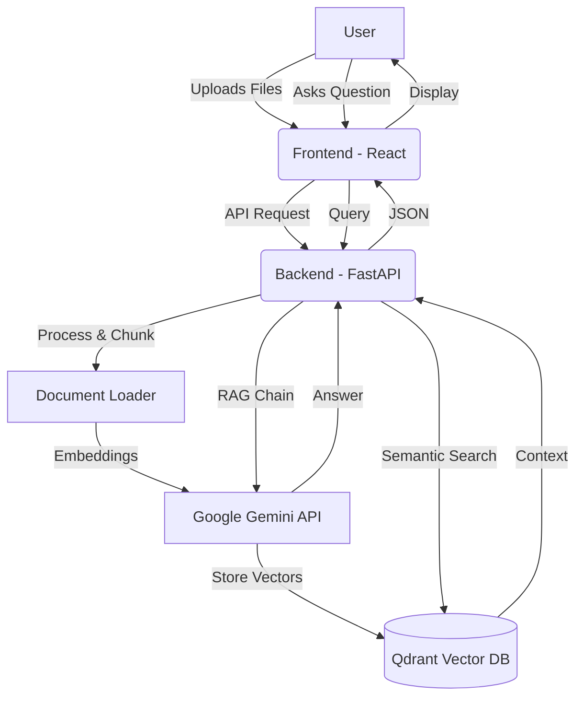

# 🤖 Document Assistant RAG

An intelligent document assistant that allows you to upload PDF/Text files and chat with them using Retrieval-Augmented Generation (RAG). Powered by **FastAPI**, **React**, **Qdrant**, and **Google Gemini**.


---

## 🚀 Key Features

- **📂 Multi-format Upload**: Support for PDF and TXT files.
- **🧠 Intelligent RAG**: Uses semantic search to find relevant context for your questions.
- **💬 Real-time Chat**: Interactive chat interface with source citations.
- **🌓 Dark Mode**: Sleek, modern design with full dark mode support.
- **🐳 Dockerized**: Easy deployment using Docker and Docker Compose.

---

## 🏗️ Architecture

The application follows a modern RAG architecture:



---

## 🛠️ Environment Variables

Create a `.env` file in the root directory based on [.env.example](.env.example):

| Variable | Description | Default |
| :--- | :--- | :--- |
| `GOOGLE_API_KEY` | Your Google AI Studio API Key | **Required** |
| `API_PORT` | Port for the Backend API | `8000` |
| `FRONTEND_PORT` | Port for the Frontend application | `5173` |
| `QDRANT_HOST` | Hostname for Qdrant | `qdrant` |
| `QDRANT_API_PORT` | Port for Qdrant API | `6333` |
| `QDRANT_GRPC_PORT` | Port for Qdrant GRPC | `6334` |

---

## 📦 Getting Started

### 1. Using Docker (Recommended) 🐳

The easiest way to run the entire stack is using Docker Compose:

```bash
# Build and start all services
docker-compose up --build
```

Access the applications at:
- **Frontend**: `http://localhost:5173`
- **Backend API**: `http://localhost:8000/docs`

### 2. Manual Setup (Development) 💻

#### Backend
```bash
cd backend
# Install dependencies (requires Poetry)
poetry install
# Run development server
poetry run python main.py
```

#### Frontend
```bash
cd frontend
# Install dependencies
npm install
# Start dev server
npm run dev
```

---

## 🧪 Technical Stack

- **Frontend**: React 19, Vite, TailwindCSS, shadcn/ui.
- **Backend**: FastAPI, LangChain, PyPDF, Qdrant Client.
- **AI/LLM**: Google Gemini (via LangChain).
- **Database**: Qdrant (Vector Database).
- **Deployment**: Docker, Docker Compose.

> [!NOTE]
> Make sure your `GOOGLE_API_KEY` has access to the Gemini 1.5 models.
